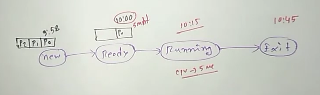

### Chapter 5 (CPU Scheduling)

### ** Define CPU scheduler.**
A CPU scheduler is a vital part of an operating system that acts as a traffic controller for the central processing unit (CPU).
It decides  the order and prioritizes in which various processes are executed on the CPU.
This is necessary because a CPU can only handle one task at a time. The CPU scheduler aims to make the system efficient, fast, and fair.
### ** Types of CPU Scheduling Algorithm.**
- Preemptive
    - Shortest Job First Scheduling
    - Priority
    - Round Robin
- Non-Preemptive 
    - First Come First Served Scheduling
    - Shortest Job First Scheduling
    - Priority
    - Multilevel 
### ** CPU Scheduling Criteria**
CPU scheduling algorithms rely on various criteria to determine how to prioritize and allocate CPU time to different processes.  These criteria influence how efficiently and fairly the system runs. Some key CPU scheduling criteria are mentioned below: 
- `CPU Utilization:` This measures how effectively the CPU is being used. Ideally, the scheduler aims for high CPU utilization to minimize idle time. 
- `Throughput:` This refers to the number of processes completed per unit time. A good scheduler should maximize throughput for efficient task completion. 
- `Turnaround Time:` This is the total time taken by a process, from submission to completion. The scheduler strives to minimize turnaround time for faster overall processing. 
- `Average Waiting Time:` This is the time a process spends waiting for the CPU after it's ready to run. The scheduler aims to keep waiting time low to prevent processes from being starved of resources. 
- `Average Response Time:` This is the time it takes for a process to first respond after submitting a request. A good scheduler minimizes response time for a more responsive user experience. 
### ** Times of CPU Scheduling Algorithm**
`Arrival Time: ` Time at which the process arrives in the ready queue. 10.00 AM  
`Burst Time: ` Burst time is the total time the process takes to execute on the CPU. 0.05 min  
`Completion/Exit Time: ` A process that completes execution and terminates. 10.45 AM 
`Turn Around Time: ` It is also called total execution time. Formula: Exit time - Arrival time. 10.45 AM - 10.00 AM = 0.45 min 
Another formula: Waiting time + burst time. 0.40 min + 0.05 min = 0.45 min 
`Waiting Time: `Turn Around time - Burst time. 0.45 min - 0.05 min = 0.40 min 
`Response Time: `The first time the process gets the CPU - Arrival time. 10.15 AM - 10.00 AM = 0.15 min  
  

### ** First Come First Serve with arrival time for non-preemptive**
 | Process | Arrival Time | Burst Time | Completion Time | Turn Around Time | Waiting Time | Response Time |
|---|---|---|---|---|---|---|
| P1 | 3 | 1 | 4 | 1 | 0 | 0 |
| P2 | 4 | 5 | 16 | 12 | 7 | 7 |
| P3 | 0 | 2 | 2 | 2 | 0 | 0 |
| P4 | 3 | 7 | 11 | 8 | 1 | 1 |
| P5 | 5 | 5 | 21 | 16 | 11 | 11 |
 

### Gantt chart: 
| P3 | idle | P1 | P4 | P2 | P5 | 
0---2-----3---4---11--16--21
 
`Average T.Around Time` = Total T.Around Time / Number of Processes 
                        = 39 / 5 
                        = 
`Throughput` = Number of Processes / Total Number of Unit Time 
            = 5 / 21 
            = 

            
### ** First Come First Serve without arrival time for non-preemptive**
| Process | Burst Time | Completion Time | Turn Around Time | Waiting Time | Response Time |
|---|---|---|---|---|---|
| P1 | 1 | 1 | 1 | 0 | 0 |
| P2 | 5 | 6 | 6 | 1 | 1 |
| P3 | 2 | 8 | 8 | 6 | 6 |
| P4 | 7 | 15 | 15 | 8 | 8 |
| P5 | 5 | 20 | 20 | 15 | 15 |
 

### Gantt chart: 
| P1 | P2 | P3 | P4 | P5 | 
0---1---6----8--15-- 20
 
`Average T.Around Time` = Total T.Around Time / Number of Processes 
                        = 50 / 5 
                        = 
`Throughput` = Number of Processes / Total Number of Unit Time 
            = 5 / 20 
            = 

### ** Shortest Job First with arrival time for non-preemptive**
 | Process | Arrival Time | Burst Time | Completion Time | Turn Around Time | Waiting Time | Response Time |
|---|---|---|---|---|---|---|
| P1 | 4 | 5 | 15 | 11 | 6 | 6 |
| P2 | 0 | 2 | 2 | 2 | 0 | 0 |
| P3 | 1 | 5 | 10 | 9 | 4 | 4 |
| P4 | 6 | 7 | 22 | 16 | 9 | 9 |
| P5 | 2 | 3 | 5 | 3 | 0 | 0 |
 

### Gantt chart: 
| P3 | P1 | P4 | P2 | P5 | 
0---2---5---10--15--22
 
`Average T.Around Time` = Total T.Around Time / Number of Processes 
                        = 41 / 5 
                        = 
`Throughput` = Number of Processes / Total Number of Unit Time 
            = 5 / 22 
            = 

### ** Shortest Job First without arrival time for non-preemptive**
| Process | Burst Time | Completion Time | Turn Around Time | Waiting Time | Response Time |
|---|---|---|---|---|---|
| P1 | 5 | 10 | 10 | 5 | 5 |
| P2 | 2 | 2 | 2 | 0 | 0 |
| P3 | 5 | 15 | 15 | 10 | 10 |
| P4 | 7 | 22 | 22 | 15 | 15 |
| P5 | 3 | 5 | 5 | 2 | 2 |
 

### Gantt chart: 
| P1 | P2 | P3 | P4 | P5 | 
0---2---5----10--15-- 22
 
`Average T.Around Time` = Total T.Around Time / Number of Processes 
                        = 54 / 5 
                        = 
`Throughput` = Number of Processes / Total Number of Unit Time 
            = 5 / 22 
            = 

### ** Priority Scheduling Algorithm with arrival time for non-preemptive**
 | Process | Priority | Arrival Time | Burst Time | Completion Time | Turn Around Time | Waiting Time | Response Time |
|---|---|---|---|---|---|---|---|
| P1 | 2 | 3 | 5 | 11 | 8 | 3 | 3 |
| P2 | 1 | 2 | 4 | 6 | 4 | 0 | 0 |
| P3 | 3 | 5 | 1 | 18 | 13 | 12 | 12 |
| P4 | 4 | 4 | 7 | 25 | 21 | 14 | 14 |
| P5 | 3 | 1 | 6 | 17 | 16 | 10 | 10 |
| p6 | 5 | 0 | 2 | 2 | 2 | 0 | 0 |
 

#### `Less value highest priority.` 

### Gantt chart: 
| P6 | P2 | P1 | P5 | P3 | P4 | 
0---2---6---11--17--18--25
 
`Average T.Around Time` = Total T.Around Time / Number of Processes 
                        = 54 / 6 
                        = 
`Throughput` = Number of Processes / Total Number of Unit Time 
            = 6 / 25 
            = 

### ** Priority Scheduling Algorithm without arrival time for non-preemptive**
Try it by yourself.

### ** Shortest Job First/SRTF with arrival time for preemptive**
 | Process | Arrival Time | Burst Time | Completion Time | Turn Around Time | Waiting Time | Response Time |
|---|---|---|---|---|---|---|
| P1 | 2 | 6 | 20 | 18 | 12 | 12 |
| P2 | 1 | 3 | 4 | 3 | 0 | 0 |
| P3 | 4 | 2 | 6 | 2 | 0 | 0 |
| P4 | 0 | 5 | 10 | 10 | 5 | 0 |
| P5 | 6 | 4 | 14 | 8 | 4 | 4 |
 

### Gantt chart: 
| P4 | P2 | P2 | P2 | P3 | P3 | P4 | P4 | P4 | P4 | P5 | P1 | 
0---1---2----3---4---5----6---7---8---9--10--14--20
 
`Average T.Around Time` = Total T.Around Time / Number of Processes 
                        = 41 / 5 
                        = 
`Throughput` = Number of Processes / Total Number of Unit Time 
            = 5 / 20 
            = 

