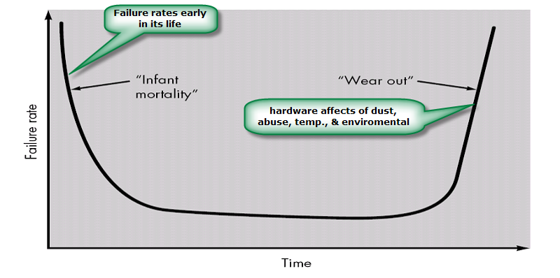
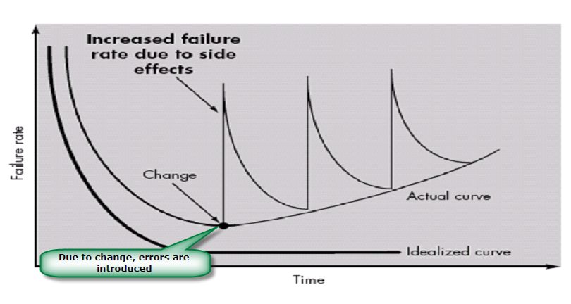
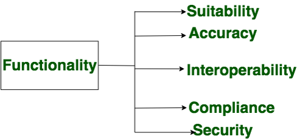
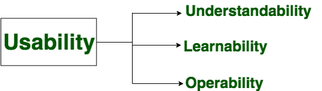
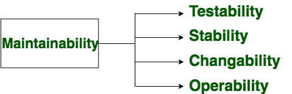
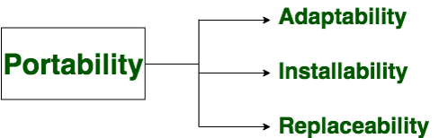
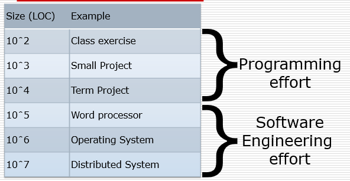
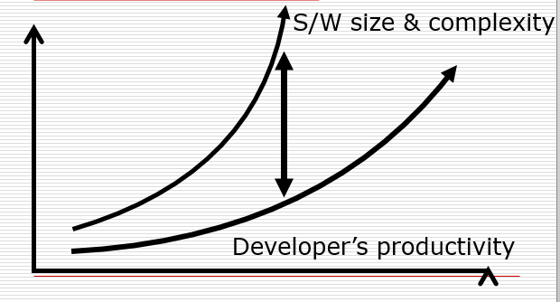
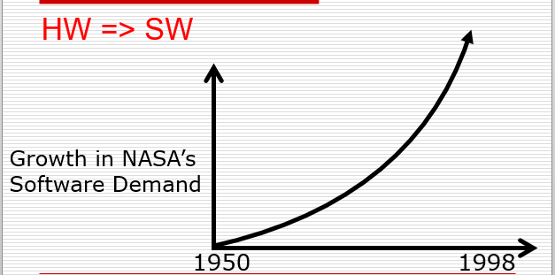

### Chapter 1 (Introduction)

### ** Define Software and Software Engineering.**
`Software:` Software is: (1) instructions (computer programs) that when executed, provide desired
features, function, and performance; (2) data structures that enable the programs to manipulate operations adequately and, (3) documents that describe the programs' operation and use. 
Software products may be 
   - Generic - developed for a general market e.g. PC software such as Excel or Word.
   - Bespoke (custom) - developed for a particular customer according to their specification.

   
   
`Software Engineering:` Software engineering is the establishment and use of sound engineering principles to obtain economic software that is reliable and works efficiently on real machines. 
In other words, Software engineering is the systematic application of engineering principles to the development, operation, and maintenance of software. It involves a disciplined approach to creating reliable, efficient, and maintainable software products.
#### Key activities in software engineering: 
  - `Requirements gathering:` Understanding the needs of the users.
  - `Design:` Creating a blueprint of the software system.
  - `Coding:` Writing the actual code using programming languages.
  - `Testing:` Ensuring the software works as expected.
  - `Deployment:` Releasing the software to users.
  - `Maintenance:` Fixing bugs, adding new features, and improving performance.

### ** Evolving Role of Software.**
Today, software takes on a dual role. It is a product, and at the same time, the vehicle for delivering a product. 
As a product, 
Transforms information such as produces, manages, acquires, modifies, displays, or transmits information.  And it delivers the computing potential of hardware and networks. 
As the vehicle for delivering a product, 
the software acts as the basis for the control of the computer (operating systems), the communication of information (networking software), and the creation and control of other programs (software tools and environments). 

### ** Difference between Hardware and Software**
###### `Hardware`
      - Manufactured
      - Wear Out
      - Built using components
      - Relatively simple
###### `Software`
      - Developed / Engineered
      - Deteriorate
      - Custom built
      - Complex

### ** Manufacturing vs. Development**
   - Once a hardware product has been manufactured, it is difficult or impossible to modify. In contrast, software products are routinely modified and upgraded.
   - In hardware, hiring more people allows you to accomplish more work, but the same does not necessarily hold true in software engineering.
   - Unlike hardware, software costs are concentrated in design rather than production.

### ** Failure curve for Hardware**
 

### ** Failure curve for Software**
 
When a hardware component wears out, it is replaced by a spare part. There are no software spare parts. Every software failure indicates an error in design or in the process through which design was translated into machine executable code. Therefore, software maintenance involves considerably more complexity. 

### ** Component-Based vs. Custom Built**
   - Hardware products typically employ many standardized design components.
   - Most software continues to be custom-built.
   - The software industry does seem to be moving (slowly) toward component-based construction.

### ** Software characteristics**
   - Software is developed or engineered; it is not manufactured.
   - The software does not “wear out” but it does deteriorate.
   - Software continues to be custom-built, as the industry is moving toward component-based construction.

### ** Components of Software**
   - Functionality
   - Reliability
   - Efficiency
   - Usability
   - Maintainability
   - Portability

#### `Functionality` 
Functionality refers to the degree of performance of the software against its intended purpose.  
 

#### `Reliability`
Reliability is a characteristic of software that refers to its ability to perform its intended functions correctly and consistently over time.  
 

#### `Efficiency`
Efficiency refers to the ability to use resources such as memory, processing power, and network bandwidth optimally. High efficiency means that a software program can perform its intended functions quickly and with minimal use of resources, while low efficiency means that a software program may be slow or consume excessive resources.  
 

#### `Usability`
Usability refers to the extent to which the software can be used with ease and the amount of effort or time required to learn how to use the software.  
 

#### `Maintainability`
Maintainability refers to the ease with which modifications can be made in a software system to extend its functionality improve its performance, or correct errors.  
 

#### `Portability`
Portability is a set of attributes that bears on the ability of software to be transferred from one environment to another, without minimum changes.  
 

### ** Software Applications**
   - System software
   - Application software
   - Engineering/scientific software
   - Embedded software
   - Product line software
   - Web applications
   - Artificial intelligence software
 

#### `System Software`
System software is a collection of programs written to service other programs. 
It is characterized by heavy interaction with computer hardware; heavy usage by multiple users; concurrent operation that requires scheduling, resource sharing, and sophisticated process management; complex data structures; and multiple external interfaces. 
`Example:` Compilers, Operating Systems, Drivers, etc. 

#### `Application Software`
Application software consists of standalone programs that solve a specific business need. Application software is used to control the business function in real time. 

#### `Engineering /Scientific Software`
It has been characterized by "number crunching" algorithms. 
Its applications range from astronomy to volcanology, from automotive stress analysis to space shuttle orbital dynamics, and from molecular biology to automated manufacturing. 

#### `Embedded Software`
It resides in read-only memory and is used to control products and systems. Embedded software can perform limited and esoteric functions. 
Ex. keypad control for a microwave oven, digital functions in an automobile such as fuel
control, dashboard displays, braking systems, etc. 

#### `Web Applications`
It is also called “WebApps". It can be little more than a set of linked hypertext files. WebApps are evolving into sophisticated computing environments that not only provide standalone features, and functions but are also integrated with corporate databases and business applications. 

#### `Artificial Intelligence software`
AI software makes use of non-numerical algorithms to solve complex problems that are not amenable to computation or straightforward analysis. 
Ex. Robotics, expert systems, game playing, etc. 

### ** Software Crisis Problem**
   - The increasing cost of Computers
   - #### `Increasing product complexity`
   - Lack of programmers
   - #### `Slow programmer’s productivity growth`
   - Lack of funding for software engineering research
   - #### `Rising demand for software`
   - Lack of caffeine in software development organizations 

   
### ** Development Effort**
 

### ** Developers Productivity Growth**
 

### ** Rising Demand for Software**
 
