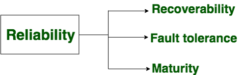

### Chapter 1 (Introduction)

### ** Define Software and Software Engineering.**
`Software:` Software is: (1) instructions (computer programs) that when executed, provide desired
features, function, and performance; (2) data structures that enable the programs to manipulate operations adequately and, (3) documents that describe the programs' operation and use. 
Software products may be 
   - Generic - developed for a general market e.g. PC software such as Excel or Word.
   - Bespoke (custom) - developed for a particular customer according to their specification.

   
   
`Software Engineering:` Software engineering is the establishment and use of sound engineering principles to obtain economic software that is reliable and works efficiently on real machines. 
In other words, Software engineering is the systematic application of engineering principles to the development, operation, and maintenance of software. It involves a disciplined approach to creating reliable, efficient, and maintainable software products.
#### Key activities in software engineering: 
  - `Requirements gathering:` Understanding the needs of the users.
  - `Design:` Creating a blueprint of the software system.
  - `Coding:` Writing the actual code using programming languages.
  - `Testing:` Ensuring the software works as expected.
  - `Deployment:` Releasing the software to users.
  - `Maintenance:` Fixing bugs, adding new features, and improving performance.

### ** Evolving Role of Software.**
Today, software takes on a dual role. It is a product, and at the same time, the vehicle for delivering a product. 
As a product, 
Transforms information such as produces, manages, acquires, modifies, displays, or transmits information.  And it delivers the computing potential of hardware and networks. 
As the vehicle for delivering a product, 
the software acts as the basis for the control of the computer (operating systems), the communication of information (networking software), and the creation and control of other programs (software tools and environments). 

### ** Software characteristics**
   - Software is developed or engineered; it is not manufactured.
   - The software does not “wear out” but it does deteriorate.
   - Software continues to be custom-built, as the industry is moving toward component-based construction.

### ** Components of Software**
   - Functionality
   - Reliability
   - Efficiency
   - Usability
   - Maintainability
   - Portability

#### `Functionality` 
Functionality refers to the degree of performance of the software against its intended purpose.  
 

#### `Reliability`
Reliability is a characteristic of software that refers to its ability to perform its intended functions correctly and consistently over time.  
 

#### `Efficiency`
Efficiency refers to the ability to use resources such as memory, processing power, and network bandwidth optimally. High efficiency means that a software program can perform its intended functions quickly and with minimal use of resources, while low efficiency means that a software program may be slow or consume excessive resources.  
 

