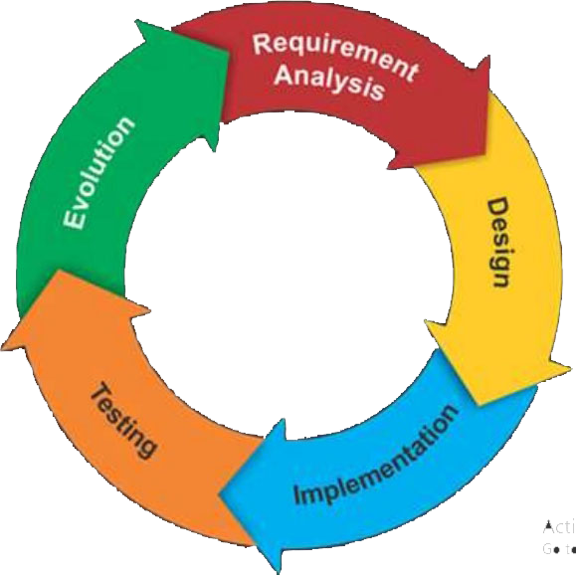

## Chapter 2 (Software Development Life-Cycle)

### ** Define Software Development Life Cycle (SDLC)**
The SDLC is a framework that describes the activities performed at each stage of a software development project. 

### ** Why used software development life-cycle**
The software industry uses the SDLC process to design, develop, and test high-quality software. It aims to produce quality software that meets or exceeds customer expectations and reaches completion within time and budget. 

### ** SDLC Phases**
 

### ** SDLC Phases**
  - Planning and Requirements Analysis
  - Defining Requirements
  - Designing the Software
  - Building or Developing the Software
  - Testing the Software
  - Deployment and Maintenance

####  Planning & Requirement Analysis 
Requirement analysis is the most fundamental stage in SDLC. The senior members of the team perform it with inputs from all the stakeholders and domain experts or SMEs in the industry.  
Planning for the quality assurance requirements and identifying the risks associated with the project is also done at this stage. 

#### `Business Requirements`
Business requirements is a phase in the Software development life cycle that greets the requirements of the end users to guide the design of the future system. 
Business requirements are usually captured by business analysts or product owners who analyze business activities or who have subject matter expertise (SMEs). 

#### `Stakeholder Requirements`
Stakeholder requirements are the needs, expectations, and desires of individuals or groups who have an interest in a software project. They form the foundation for successful software development by ensuring that the final product meets the needs of its intended users and aligns with the goals of the organization. 
Two types of stakeholders: 
- `Internal stakeholders:` Employees, managers, and executives within the organization.
- `External stakeholders:` Customers, end-users, partners, regulators, and investors.

By effectively managing stakeholder requirements, organizations can ensure that their software projects deliver value, meet the needs of their target audience, and contribute to overall business success. 

#### `Functional Requirements`
Functional requirements define the specific behaviors and capabilities that a software system must exhibit to meet its intended purpose. Such as 
  - User interface
  - Data processing
  - Performance
  - Login/Registration
  - Search Functionality
  - Data Export
  - Order Processing, etc.

By clearly defining and validating functional requirements, software development teams can ensure that the final product meets the needs of its users and delivers the desired value. 

#### `Non-functional Requirements`
Non-functional requirements specify the attributes and characteristics of a software system that are not directly related to its specific functions. such as 
  - Performance
     - Response time
     - Throughput
     - Scalability
     - Capacity
 - Security
 - Reliability
 - Usability
 - Maintainability
   
By effectively managing non-functional requirements, software development teams can ensure that the final product not only meets its intended functionality but also delivers a high-quality user experience, is reliable, secure, and meets other important quality attributes. 

#### `Transition Requirements`
Transition requirements specify the conditions and processes necessary to successfully migrate from an existing system or process to a new one. They play a crucial role in ensuring a smooth and efficient transition, minimizing disruptions and risks. 
Organizations can minimize disruptions and ensure a successful transition to new systems by effectively managing transition requirements. This can improve efficiency, reduce costs, and enhance business outcomes. 

####  Defining Requirements 
After requirement analysis, the next step is clearly defining and documenting the software requirements and getting them approved by the project stakeholders. 
This is done through the ‘SRS’ – Software Requirement Specification document which consists of all the product requirements to be designed and developed during the project life cycle. 

#### `Enterprise Analysis`
Enterprise Analysis is a crucial phase in the Software Development Life Cycle (SDLC), particularly in the early stages of software project planning. It focuses on understanding the business goals, problems, and opportunities that drive the need for a software solution. This process ensures that the software development aligns with the overall business objectives and delivers value. 

#### `Business Analysis, Planning, and Monitoring`
Business Analysis Planning and Monitoring is a key knowledge area within the Software Development Life Cycle (SDLC). It involves defining and coordinating the business analysis approach, processes, and activities that will be used throughout the project. This phase is crucial for ensuring that business analysis efforts are aligned with the project’s goals and are executed efficiently and effectively. 

#### `Elicitation`
Elicitation is a critical phase in the software development lifecycle (SDLC) that involves gathering information from stakeholders to understand their needs, requirements, and expectations for the software system. This information is essential for defining the scope, features, and functionality of the software. 

