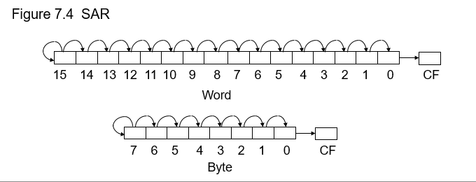

### ** What is flag? Explain signed overflow and unsigned overflow with example.**
A flag is a bit in a register that indicates the status or outcome of different operations. These flags provide information about conditions like arithmetic overflows, zero results, carry operations, etc. 
Signed and unsigned overflows are Independent phenomena. 
"Signed overflow" occurs when the result of a calculation on a signed number(which can be positive or negative) exceeds the representable range of the data type, causing an incorrect value due to the sign bit being affected. 

"Unsigned overflow" happens when the result of a calculation on unsigned numbers (only positive) exceeds the maximum value that can be stored within the allocated bits, regardless of the sign; essentially, both  situations mean the calculation produced a value too large to fit in the available memory space.  
Example with 8-bit representation:  
`Signed Overflow:` 
	- Consider two positive numbers: +127 and +1. 
	- Binary representation of 127 is 01111111. 
	- Adding 1 results in 10000000, which is -128(due to two's complement representation). 
	- This is considered a signed overflow since adding two positive numbers resulted in a negative value.  
`Unsigned Overflow:` 
	- Adding 200 and 100 results in 300 which can't be represented in 8 bits. So an unsigned overflow occurs. 
	- However, adding 100 and 50 gives 150, within the 8-bit range(0 - 255), so no overflow occurs. 

### ** How flags are affected by signed and unsigned overflow.**

`Signed Overflow: ` 

OF is set: When the result of a signed addition or subtraction operation exceeds the range of the destination operand, an overflow occurs. This means that the sign of the result is incorrect. 
OF is not set: If the result of a signed operation is within the range of the destination operand, there is no overflow. 
`Unsigned Overflow: ` 

CF is set: When the result of an unsigned addition or subtraction operation generates a carry or borrow, an overflow occurs. This means that the result has exceeded the maximum unsigned value. 
CF is not set: If the result of an unsigned operation is within the range of the destination operand, there is no overflow. 

### ** Read a character. If  it’s  “y”’ or “Y”, display it;  otherwise, terminate the program.**
Solution:  
		MOV  AH,1 
		INT  21H 
		CMP  AL, ‘y’ 
		JE  THEN 
		CMP  AL, ‘Y’ 
		JE  THEN 
		JMP  ELSE_   
	THEN:  MOV  AH, 2 
		MOV  DL, AL 
		INT  21H 
		JMP  END_IF   
	ELSE_:    MOV  AH, 4CH 
		  INT  21H 
	END_IF: 

### ** What is Program Segment Prefix? Explain**

A Program Segment Prefix (PSP) is a data structure used in DOS (Disk Operating System) environments to store information about a program that is currently executing.
When a program is loaded in memory, DOS prefaces it with a 256-byte program segment prefix (PSP). The PSP contains information about the program. 
So that programs may access this area, DOS places its segment number in both DS and ES before executing the program. The result is that DS does not contain the segment number of the data segment.
 To correct this, a program containing a data segment begins with these two instructions: 

MOV AX, @DATA 
MOV DS, AX 

@DATA is the name of the data segment defined by .DATA. The assembler translates the name @DATA into a segment number. 
Our second program will print a sting of characters on monitor. 

TITLE	 PGM4_2:  PRINT STRING PROGRAM 

.MODEL SMALL 
.STACK 100H 
.DATA 
 MSG  DB  ‘HELLO$’ 
.CODE 
MAIN PROC 

MOV AX, @DATA 
MOV DS, AX 
LEA DX, MSG 
MOV AH,9 
INT 21H 
MOV AH,4CH 
INT 21H 

MAIN ENDP 
END MAIN 

### ** Properties of AND, OR, and XOR**

The AND instruction can be used to clear specific destination bits while preserving the others. A 0 mask bit clears the corresponding destination bit; A 1 mask bit preserves the corresponding destination bit. 

The OR instruction can be used to set specific destination bits while preserving the others. A 1 mask bit sets the corresponding destination bit; A 0 mask bit preserves the corresponding destination bit. 

The XOR instruction can be used to complement specific destination bits while preserving the others. A 1 mask bit complements the corresponding destination bit; A 0 mask bit preserves the corresponding destination bit. 

### ** Why do we write the following two statements in the assembly language code?** 
MOV AH, 4CH 
INT 21H  

The two assembly language statements: 
MOV AH, 4CH 
INT 21H 
are commonly used in DOS (Disk Operating System) programs for terminating the program and returning control to the operating system. 
MOV AH, 4Ch sets up the DOS function to terminate the program. 
INT 21h makes the system call, invoking DOS to handle the function (terminate the program in this case). 
This combination is standard for ending a DOS-based program. 

### ** Discuss SAL and SAR instructions of the 8086 microprocessor.**
`SAL: `
The SAL instruction is often used for arithmetic multiplication. However, both SHL and SAL instructions generate the same machine code. 
Negative numbers can also be multiplied by powers of 2 by left shifts.
Suppose AX=FFFFH (-1), CL=03H, then SAL AX, CL gives AX=FFF8H (-8).  

`SAR: `
The SAR instruction operates like SHR, with one difference; the MSB retains its original value (Figure 7.4). The syntax is  

SAR  destination, 1 
and  
SAR  destination, CL 

The effect on flags is the same as for SHR. 

