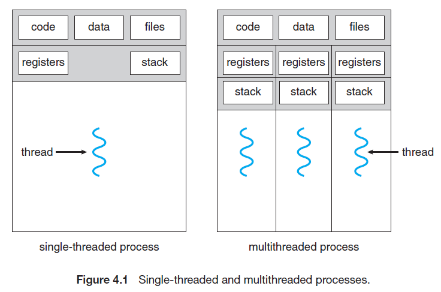

### Chapter 4 (Threads)

### ** What is Threads?**
  - A thread is a lightweight process. Every thread belongs to exactly one process.
  - There is no need to allocate extra memory space for threads.
  - Each thread has its thread. Id, stack, register, & program counter.
  - Threads will be executed in a sequenced manner.
  - There is no need to interact with the operating system for switching one thread to another.
  - There is no system call in a thread. 
 
