### Chapter 1 (Introduction)

### **<br/>What is Operating System?**
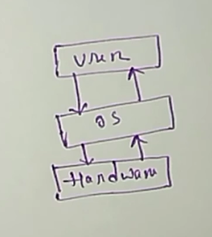
Operating system is a program that acts as an interface between the user and the hardware. It is a resource allocator and provides a platform for the application program.
 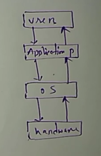


### **<br/>What are the elements of computer system structure?**
The computer system structure consists of four components. There are-
  - Hardware<br/>
  - Operating System<br/>
  - Application program<br/>
  - User<br/>
 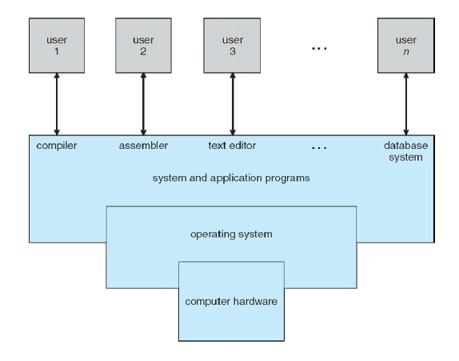
### **Goals of Operating System**
 - Execute user programs and make solving user problems easier.
 - Make the computer system convenient to use.
 - Efficiently use the computer Hardware.

### **<br/>Functions of an Operating System**
 - Memory management.
 - Process management.
 - Device management.
 - File management.
 - Security.
 - Control over system performance.
 - Job accounting.
 - Error detecting aids.
 - Coordination between other software and user.

   ### **<br/>Define Batch Operating System**
    This type of operating system does not interact with the computer directly. An operator groups similar jobs with the same requirements into batches.<br/><br/>
   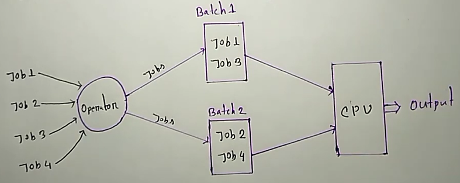

 ### **<br/>Problems of Batch Operating System**
  - Lack of interaction between the user & the job.
  - CPU is often idle because the speed of I/O is slower than CPU.
  - Difficult to provide the desired priority.

 ### **<br/>Define Multiprogramming**
 Multiprogramming is a fundamental concept in operating systems that allows multiple programs to run simultaneously on a single processor. This technique aims to maximize CPU utilization and increase overall system throughput by overlapping CPU execution with I/O operations. It is also called Non-preemptive.<br/><br/>
  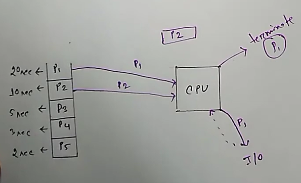
 ### **<br/>Define Multitasking/Time sharing**
 Multitasking, also known as time-sharing or multitasking operating system, allows multiple tasks to run concurrently on a single processor. This functionality enables users to run multiple applications simultaneously and switch between them seamlessly.<br/><br/>
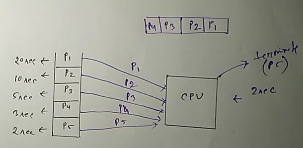
 
### **<br/>Define Multiprocessing operating system**
It uses two or more central processing units (CPUs) within a single computer.<br/>It refers to a computer system's ability to support multiple processes simultaneously.<br/><br/>
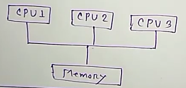<br/>
Types of multiprocessing<br/>
 - Symmetric
 - Asymmetric<br/><br/>
`Symmetric:` All the processors have the same function and control access.<br/>
`Asymmetric:` There is a master processor that gives instructions to all other processors. An asymmetric multiprocessor system contains a master-slave relationship.<br/>
##### Advantage:<br/>
 1. More reliable systems
 2. Enhance throughput
 3. More economic system<br/>
##### Disadvantage:<br/>
 1. Increased expense
 2. A complicated operating system is required.
 3. Large main memory required.

### **<br/>Define Real-Time Operating System**
A real-time operating system is an operating system intended to serve real-time applications. <br/>Response should be guaranteed within a specified timing constraint or the system should meet the specified deadline.<br/>
Types of Real-Time Operating System:<br/>
 - Hard Real-Time System
 - Soft Real-Time System<br/>
`Hard Real-Time System:` This type of OS can never its deadline.<br/> Strongly determined with its time constraint.<br/>
`Soft Real-Time System:` This type of OS can miss its deadline occasionally with some acceptable low probability.
### **<br/>Kernel and System call Operating System**
The kernel is a computer program at the core of a computer operating system which complete control over everything in the system. It is an integral part of any operating system.<br/>
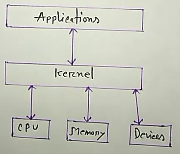
### **<br/>User mode and Kernel mode**
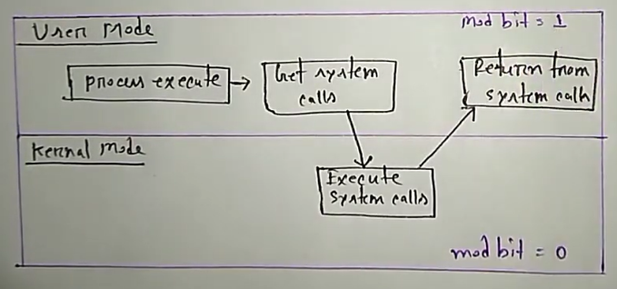<br/>
### **<br/>Fork() system call**
`fork():` Fork system call is used for creating a new process, which is called the child process. Here child process will run concurrently with its parent process. <br/> fork() returns an integer value, where <br/>
`Negative value:` Creation of a child process was unsuccessful.<br/>
`Zero:` Returned to the newly created child process.<br/>
`Positive value:` Returned to parent or caller. The value contains the process ID of a newly created child process. <br/>
##### `Example:`<br/>
```
#include<stdio.h>
int main()
{
fork();
fork();
print("Hello");
fork();
print("Bangladesh");
}
```
```
output:
Bangladesh
Bangladesh
Bangladesh
Bangladesh
Bangladesh
Bangladesh
Bangladesh
Bangladesh
```
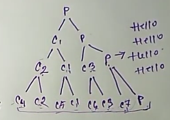<br/>
Process = 2 ^ n (where n = no. of fork)<br/>
        = 2 ^ 3 <br/>
        = 8 <br/>
Child process = 2 ^ n - 1 <br/>
              = 2 ^ 3 - 1 <br/>
              = 7
##### `Example:` 
```
int main()
{
 int a,b,c;
 a = 5, b = 3;
 if(fork() == 0{
 c = a - b;
 print("Child result = %d\n"c);
 }else{
 c = a + b;
 print("Parent result = %d\n"c);
 }
}
```
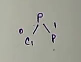<br/>
```
Output:
Parent result = 8
Child result = 2
```

### **<br/>Fork() system call using OR operator**
##### `Example: 1` 
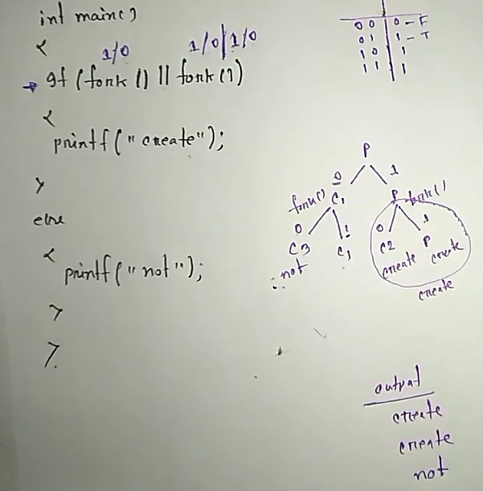<br/>
##### `Example: ` 
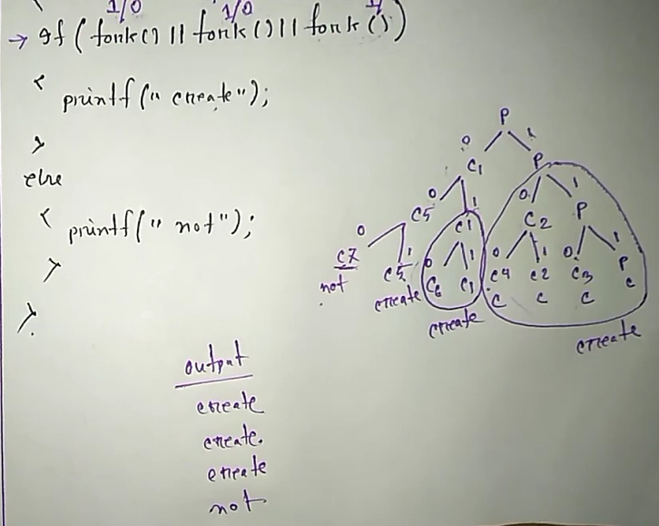<br/>
