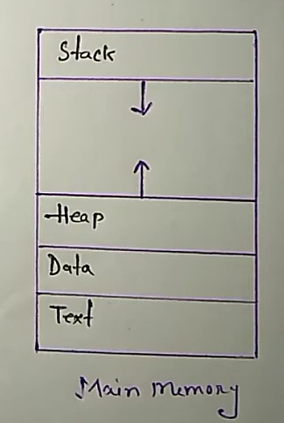
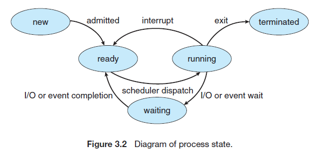
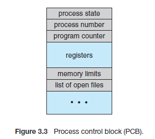

### Chapter 3 (Process Management)

### ** Define Process**
In the operating system, a process is a program currently under execution. An active program can be called a process.  

 
#### `Stack: `The process stack contains the temporary data such as method/function, parameters, return address, and local variables. 
#### `Heap: `This is dynamically allocated memory to a process during its run time. 
#### `Text: `This includes the current activity represented by the value of the program counter and the contents of the processor's registers. 
#### `Data: `The section contains the global and static variables. 

### ** Process state transition**
As a process executes, it changes state. The state of a process is defined in part by the current activity of that process. Each process may be in one of the following states: 
- #### `New: `The process is being created.
- #### `Ready: `The process is waiting to be assigned to a processor.
- #### `Running: `Instructions are being executed.
- #### `Waiting: `The process is waiting for some event to occur (such as an I/O completion or reception of a signal).
- #### `Terminated: `The process has finished execution.
 
 

### ** Process Control Block**
A process control block (PCB) represents each process in the operating system. It is also called a task control block. It contains many pieces of information associated with a specific process, including these: 
 

- #### `Process state: `The state may be new, ready, running, waiting, etc.
- #### `Program counter: `The counter indicates the address of the next instruction to be executed for this process.
- #### `CPU registers: `The registers vary in number and type, depending on the computer architecture. They include accumulators, index registers, stack pointers, general-purpose registers, and condition-code information. Along with the program counter, this state information must be saved when an interrupt occurs, to allow the process to be continued correctly afterward.
- #### `CPU-scheduling information: `This includes a process priority, pointers to scheduling queues, and any other scheduling parameters.
- #### `Memory-management information: `This information may include the value of the base and limit registers, the page tables, or the segment tables, depending on the memory system used by the operating system.
- #### `Accounting information: `This includes the amount of CPU and real-time used, time limits, account numbers, process numbers, etc.
- #### `I/O status information: `This includes the list of I/O devices allocated to the process, a list of open files, and so on.

  

