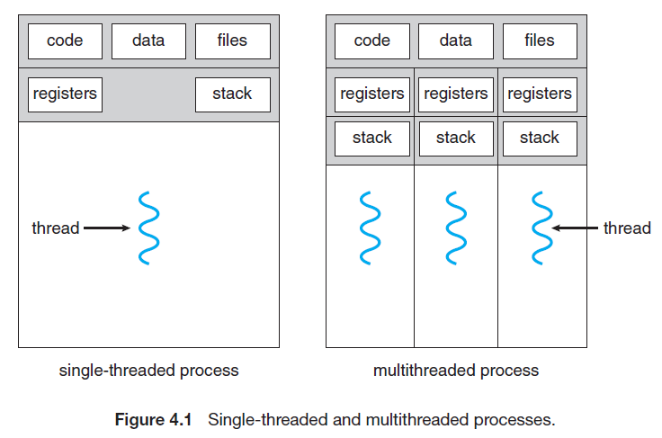

### Chapter 4 (Threads)

### ** What is Threads?**
  - A thread is a light weight process. Every thread belongs to exactly one process.
  - There is no need to allocate extra memory space for threads.
  - Each threads has its own thread. Id, stack, register, & program counter.
  - Threads will be executed in a sequence manner.
  - For switching one thread to another thread, no need to interact with operating system.
  - There is no system call in a thread. 
 
